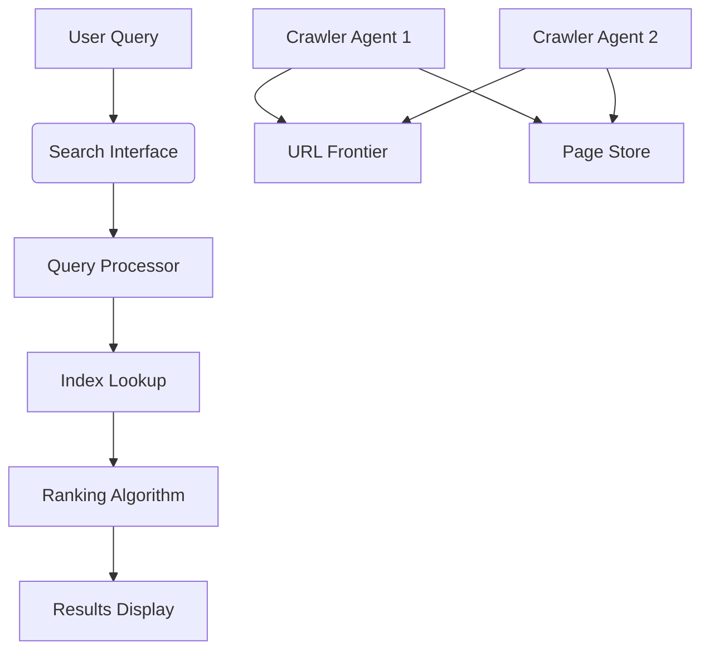

# Basic Search Engine using Agents


A lightweight search engine implementation using web crawling agents, built with Python and Flask. This project demonstrates fundamental search engine concepts including web crawling, indexing, and ranking.

## Features

- Multi-agent web crawler system
- Basic text indexing and retrieval
- Simple ranking algorithm
- Web interface for searching
- Configurable crawling depth and limits
- URL frontier management


## Installation

1. Clone the repository:
```bash
git clone https://github.com/shreyash4145/Basic_Search_engine_using_Agents.git
cd Basic_Search_engine_using_Agents
```

2. Install the required dependencies:
```bash
pip install -r requirements.txt
```

## Usage

1. Run the Flask application:
```bash
python app.py
```

2. The web interface will be available at:
```
http://localhost:5000
```

3. Configuration options (in `config.py`):
```python
MAX_PAGES_TO_CRAWL = 100  # Maximum pages to crawl
MAX_DEPTH = 2            # Maximum crawl depth
CRAWL_DELAY = 1          # Delay between requests (seconds)
```

## Architecture Overview



## How It Works

1. **Crawling Agents**: Multiple agents crawl web pages from a seed URL
2. **Indexing**: Extracted text is processed and added to the search index
3. **Query Processing**: User queries are matched against the index
4. **Ranking**: Results are ranked based on simple TF-IDF scoring
5. **Display**: Results are displayed with relevant snippets

## API Endpoints

- `POST /crawl`: Start a new crawl job
```json
{
  "seed_url": "http://example.com",
  "max_pages": 50,
  "max_depth": 2
}
```

- `GET /search?q=query`: Search the index
```json
{
  "results": [
    {
      "title": "Page Title",
      "url": "http://example.com/page",
      "snippet": "Relevant text snippet..."
    }
  ]
}
```
## Future Improvements

- [ ] Add more sophisticated ranking algorithms
- [ ] Implement duplicate content detection
- [ ] Add persistent storage for the index
- [ ] Support for JavaScript-rendered pages
- [ ] Distributed crawling capabilities


## Contact

Shreyash - [@shreyash4145](https://github.com/shreyash4145)

Project Link: [https://github.com/shreyash4145/Basic_Search_engine_using_Agents](https://github.com/shreyash4145/Basic_Search_engine_using_Agents)
```
